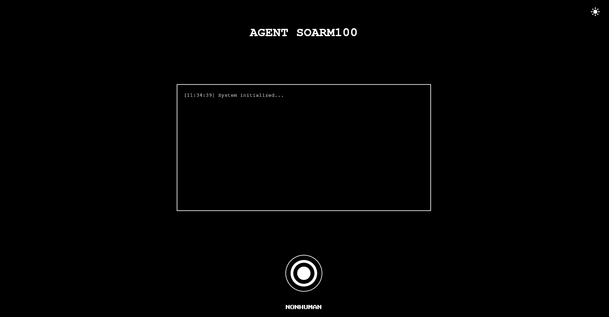
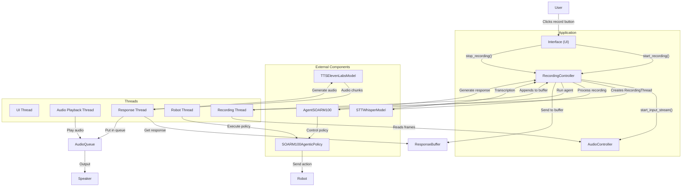

# AGENTIC SOARM100



## Overview
AGENTIC SOARM100 is a guide to integrating LLMs with your SOARM100 robot. We provide an interface using Flet, allowing natural interaction and control of the robot. This system combines LLMs, Text-to-Speech (TTS), and Speech-to-Text (STT) to enhance user experience.

Currently, we support:
- OpenAI models for LLM.
- Whisper API and FlashWhisperLocal for STT.
- ElevenLabs API for TTS.
- LangGraph for a more versatile interaction system, enabling multi-step intelligent actions without explicit user commands.

## Installation
To install the required dependencies, run:
```sh
pip install .[agentic]
```
This will install all necessary dependencies from `pyproject.toml`. The minimum Python version required is `3.10`.

### Creating a Conda Environment
Follow these steps to create an isolated Conda environment:
```sh
conda create -n agentic_soarm100 python=3.10
conda activate agentic_soarm100
pip install .[agentic]
```

## Execution
To run the system, execute the following command:
```sh
python agentic_soarm100.py \
  --robot.type=so100 \
  --control.type=record \
  --control.fps=30 \
  --control.single_task="" \
  --control.repo_id=${HF_USER}/eval_act_so100_test \
  --control.warmup_time_s=5 \
  --control.episode_time_s=30 \
  --control.reset_time_s=30 \
  --control.num_episodes=10 \
  --control.push_to_hub=true \
  --control.policy.path=/home/leonardo/lerobot/lerobot/outputs/ckpt_test/pretrained_model
```
These parameters ensure compatibility with the `lerobot` library. None of them affect the algorithm controlling the AGENTIC SOARM100.

## Adding New Skills
To add new skills to your SOARM100, follow these steps:

1. Train multiple policies for SOARM100.
2. Modify the file `soarm100/agentic/llm/tools.py` to define when and how a tool should be used.

Example:
```python
class PutMarkerInBoxTool(BaseTool):
    name: str = "put_marker_in_box"
    description: str = "This tool is used to put the marker in the box."
    robot_policy: Optional[SOARM100AgenticPolicy] = None

    def __init__(self, robot_policy: SOARM100AgenticPolicy):
        super().__init__()
        self.robot_policy = robot_policy

    def _run(self, *args, **kwargs) -> str:
        self.robot_policy.change_policy("put_marker_in_box")
        return "Putting the marker in the box"
    
    def _arun(self, *args, **kwargs) -> str:
        return self._run(*args, **kwargs)
```
Ensure that `self.robot_policy.change_policy()` is correctly linked to the robot's skills.

3. Update `soarm100/agentic/robot.py` by modifying the `POLICIES` dictionary:
```python
POLICIES = {
    "NULL": None,
    "put_marker_in_box": "path/to/your/policy/pretrained_model",
    "teleop": None
}
```
By default, two policies are available: stopping and teleoperation. You can add as many policies as you want. 

## Architecture
Below is the general diagram of the AGENTIC SOARM100 architecture:



## Customizing the Robot's Personality
To modify the robot's behavior and personality, update the system prompt in:
```sh
soarm100/agentic/llm/prompts.py
```
Define the desired behavior and interaction style within this prompt.

## Contribution
Contributions are welcome! You can help improve this project by adding:
- More local LLM integrations.
- Additional STT models.
- Expanded TTS options.

Feel free to submit pull requests and improve AGENTIC SOARM100!

