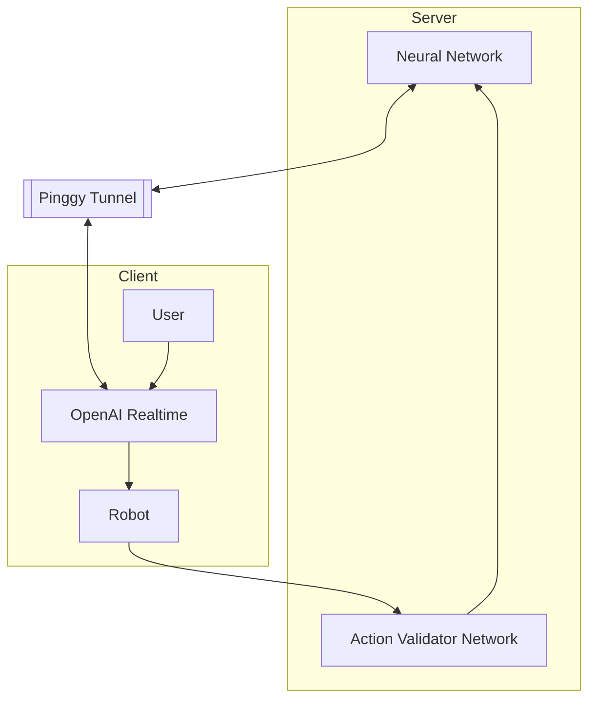

# Agentic SOARM100

This project introduces a novel way to interact with your robot, leveraging **OpenAI Realtime** [(https://platform.openai.com/docs/guides/realtime)](https://platform.openai.com/docs/guides/realtime) and its low-latency and VAD (Voice Activity Detection) capabilities to enable more fluid and natural communication. Additionally, we use **Isaac Gr00t** [(https://github.com/NVIDIA/Isaac-GR00T)](https://github.com/NVIDIA/Isaac-GR00T) as the VLA (Voice Language Agent) to control the robot.

The architecture is based on a server-client model communicating via either **TCP** or **WebSocket**. To establish the connection, we use a tunneling bridge created with **Pinggy** [(https://pinggy.io/)](https://pinggy.io/). On the server side, the neural network runs continuously and receives current input states from the client. The server then returns the corresponding action for the client to execute.

On the client side, OpenAI Realtime acts as an intermediate communication layer between the user and the robot. The robot also sends feedback to the server through the client. Additionally, an auxiliary neural network verifies whether the executed robot action was successful or not.



## Getting Started

To set up the bridge using Pinggy, run the following command:

```bash
ssh -p 443 -R0:localhost:3000 -o StrictHostKeyChecking=no -o ServerAliveInterval=30 DHxZQnSOvyy+tcp@free.pinggy.io
```

Then, use the appropriate protocol (TCP or WebSocket) by referencing the URI provided by Pinggy.