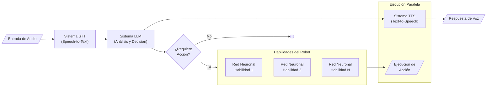

```mermaid
flowchart LR
    Input[/"Entrada de Audio"/]
    
    STT["Sistema STT\n(Speech-to-Text)"]
    
    LLM["Sistema LLM\n(Análisis y Decisión)"]
    
    Eval{"¿Requiere\nAcción?"}
    
    subgraph Skills ["Habilidades del Robot"]
        direction TB
        Skill1["Red Neuronal\nHabilidad 1"]
        Skill2["Red Neuronal\nHabilidad 2"]
        SkillN["Red Neuronal\nHabilidad N"]
    end
    
    subgraph Parallel ["Ejecución Paralela"]
        direction TB
        TTS["Sistema TTS\n(Text-to-Speech)"]
        Action[/"Ejecución de\nAcción"/]
    end
    
    Response[/"Respuesta de Voz"/]
    
    Input --> STT
    STT --> LLM
    LLM --> TTS
    LLM --> Eval
    Eval -->|"Sí"| Skills
    Eval -->|"No"| Blank((" "))
    Skills --> Action
    TTS --> Response
```